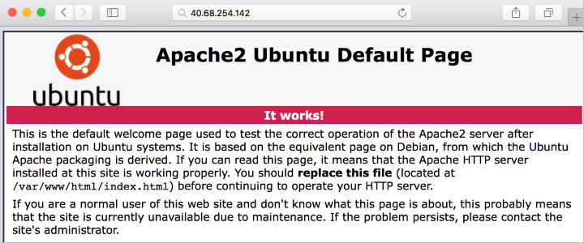
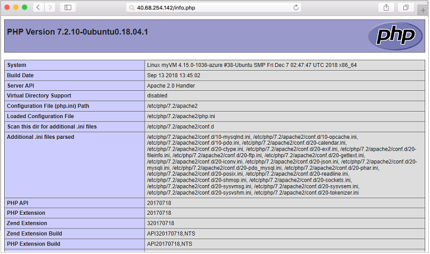
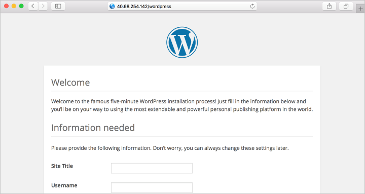

# 参照

[チュートリアル: Azure Linux VM に LAMP スタックをインストールする](https://learn.microsoft.com/ja-jp/azure/virtual-machines/linux/tutorial-lamp-stack)

本ドキュメントは上記のコードで上手く動かない部分（ポートを開ける部分等）や環境変数の設定等修正したもの。

１つのVM上にWordpresを含めたLAMP環境を構築する。

本構成は簡易版のため冗長化等対応が必要。

# 事前準備

Azure Cloud Shellの準備

# 環境変数の設定
適宜変更する

```bash
resourceGroup=myResourceGroup
vnetName=myVnet
subnetName=mySubnet
nsgName=myNsg
publicIpName=myPublicIp
nicName=myNic
vmName=myVM
vmAdminName=azureuser
```

# リソースグループを作成

```bash
az group create --name $resourceGroup --location japaneast
```

# VNetとサブネットを作成
```bash
az network vnet create \
  --name $vnetName \
  --resource-group $resourceGroup \
  --address-prefixes 10.0.0.0/16 \
  --subnet-name $subnetName \
  --subnet-prefixes 10.0.0.0/24
```

# ネットワークセキュリティグループを作成
```
az network nsg create \
  --name $nsgName \
  --resource-group $resourceGroup
```

# NSGルールを作成
```bash
az network nsg rule create \
  --resource-group $resourceGroup \
  --name allow-ssh \
  --nsg-name $nsgName \
  --priority 100 \
  --source-address-prefixes '*' \
  --destination-port-ranges 22 \
  --access Allow \
  --protocol Tcp \
  --description "SSH"
```

```bash
az network nsg rule create \
  --resource-group $resourceGroup \
  --name allow-http \
  --nsg-name $nsgName \
  --priority 200 \
  --source-address-prefixes '*' \
  --destination-port-ranges 80 \
  --access Allow \
  --protocol Tcp \
  --description "HTTP"
```

# パブリックIPの作成
```bash
az network public-ip create --resource-group $resourceGroup --name $publicIpName --sku Standard

```

# ネットワークインターフェースを作成
```bash
az network nic create \
  --name $nicName \
  --resource-group $resourceGroup \
  --vnet-name $vnetName \
  --subnet $subnetName \
  --network-security-group $nsgName \
  --public-ip-address $publicIpName
```

# 仮想マシンを作成
```bash
az vm create \
  --name $vmName \
  --resource-group $resourceGroup \
  --image UbuntuLTS \
  --size Standard_B1s \
  --authentication-type ssh \
  --admin-username $vmAdminName \
  --generate-ssh-keys \
  --nics $nicName
  ```

# パブリックIPの取得

```bash
az network public-ip list --resource-group $resourceGroup --query [].ipAddress
```

# SSH接続

```bash
ssh myusername@20.222.139.118
```
Azure Cloud Shell以外
```
ssh -h <秘密鍵のパス> myusername@20.222.139.118
```

# Apache,MySQL,PHPインストール

```
sudo apt update && sudo apt install lamp-server^
```

# Apacheを確認する

```bash
apache2 -v
```

WebからもパブリックIPも通じて確認できる




# MySQL を確認してセキュリティで保護する

```bash
mysql -V
```
MySQL のインストールのセキュリティ保護を強化 (ルートのパスワードを設定するなど) するには、mysql_secure_installation スクリプトを実行。


```bash
sudo mysql_secure_installation
```

必要に応じてValidate Password プラグインを設定することもできる (推奨)。 次に、MySQL のルート ユーザーに使用するパスワードを設定し、その他、環境のセキュリティ設定を構成します。 質問にはすべて "Y" (はい) で答えることがお勧め。

MySQL の機能 (MySQL データベースの作成、ユーザーの追加、構成設定の変更) を試したい場合は、MySQL にログイン。 このチュートリアルを実行するには、このステップは必要なし。

```bash
sudo mysql -u root -p
```

完了したら`\q`と入力して、mysqlプロンプトを終了する


# PHP を確認する
次のコマンドで PHP のバージョンを確認します。

```bash
php -v
```

さらに詳しくテストする場合は、簡単な PHP 情報ページを作成して、ブラウザーで表示。 次のコマンドは、PHP 情報ページを作成。

```bash
sudo sh -c 'echo "<?php phpinfo(); ?>" > /var/www/html/info.php'
```

ここで作成した PHP 情報ページを確認可能。 ブラウザーを開き、http://yourPublicIPAddress/info.php に移動。 



# Wordpressのインストール

```bash
sudo apt install wordpress
```

# Wordpressの構成
MySQL と PHP を使うように WordPress を構成します。

作業ディレクトリに wordpress.sql というテキスト ファイルを作成し、WordPress 用の MySQL データベースを構成。

```bash
sudo sensible-editor wordpress.sql
```
次のコマンドを追加します。yourPassword は、ご自分で選ばれたデータベース パスワードに置き換えます (他の値はそのままでかまいません)。 前にパスワードの強度を検証するために MySQL セキュリティ ポリシーをセットアップした場合は、パスワードが強度の要件を満たすことを確認します。 ファイルを保存。


```sql
CREATE DATABASE wordpress;
GRANT SELECT,INSERT,UPDATE,DELETE,CREATE,DROP,ALTER
ON wordpress.*
TO wordpress@localhost
IDENTIFIED BY 'yourPassword';
```

次のコマンドを実行してデータベースを作成。


```bash
cat wordpress.sql | sudo mysql --defaults-extra-file=/etc/mysql/debian.cnf
```
wordpress.sql ファイルにはデータベースの資格情報が含まれているので、使った後で削除。

```bash
sudo rm wordpress.sql
```

PHP を構成するには、次のコマンドを実行して任意のテキスト エディターを開き、/etc/wordpress/config-localhost.php というファイルを作成。

```bash
sudo sensible-editor /etc/wordpress/config-localhost.php
```
このファイルに次の行をコピー。yourPassword は、実際の WordPress データベースのパスワードに置き換えてください (他の値はそのままでかまいません)。 そのうえでファイルを保存。

```bash
<?php
define('DB_NAME', 'wordpress');
define('DB_USER', 'wordpress');
define('DB_PASSWORD', 'yourPassword');
define('DB_HOST', 'localhost');
define('WP_CONTENT_DIR', '/usr/share/wordpress/wp-content');
?>
```

WordPress のインストールを Web サーバーのドキュメント ルートに移動。

```bash
sudo ln -s /usr/share/wordpress /var/www/html/wordpress

sudo mv /etc/wordpress/config-localhost.php /etc/wordpress/config-default.php
```
  
# ワードプレスへのアクセスし確認する
http://yourPublicIPAddress/wordpress

