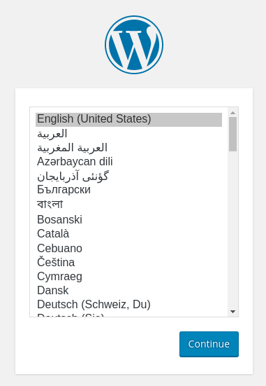
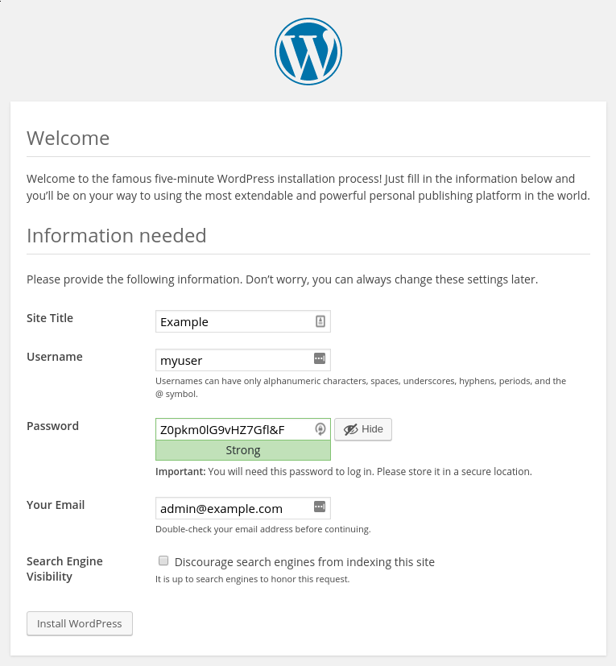

# 参考リンク

[Deploy a highly available and scalable Wordpress on Azure](https://techcommunity.microsoft.com/t5/fasttrack-for-azure/deploy-a-highly-available-and-scalable-wordpress-on-azure/ba-p/2507554)

本ドキュメントは日本語化＋2023年03月時点で動かないコードを修正したもの。


# Architecture


# 事前準備

- Azure Cloud Shellの準備


# 変数の定義

最低限サブスクリプションとリソースグループは変更する。

```bash
subscriptionId="XXXXXXXX-XXXX-XXXX-XXXX-XXXXXXXXXXXX"
resourceGroupName="myResourceGroup"
storageAccountName="mystorageacct$RANDOM"
region="westus2"
shareName="myshare$RANDOM"
mysqlServerName="myserver$RANDOM"
mysqlAdmin="myadmin"
mysqlPassword="MyWeaKPassw0rd"
privateEndpointNameStorage="myStoragePrivateEndpoint"
privateConnectionNameStorage="myStorageConnection"
privateDNSZoneNameStorage="privatelink.file.core.windows.net"
privateDNSZoneGroupNameStorage="MyStorageZoneGroup"
privateDNSLinkNameStorage="MyStorageDNSLink"
privateEndpointNameDatabase="myDatabasePrivateEndpoint"
privateConnectionNameDatabase="myDatabaseConnection"
privateDNSZoneNameDatabase="privatelink.mysql.database.azure.com"
privateDNSLinkNameDatabase="MyDatabaseDNSLink"
privateDNSZoneGroupNameDatabase="MyDatabaseZoneGroup"
dbname="wordpressdb"
dbuser="db_user"
dbpassword="db_user-weakPassword"
ScaleSetName="myScaleSet"
VNETName="myVNET"
SubnetName="mySubnet"
BackendSubnetName="myBackendSubnet"
AppGWPublicIPAddressName="myAppGWPublicIP" 
```
# リソースグループの作成

```bash
az group create --name $resourceGroupName --location $region
```

# VNETの作成

```bash
az network vnet create \
    --resource-group $resourceGroupName\
    --location $region \
    --name $VNETName \
    --address-prefixes 10.0.0.0/16 \
    --subnet-name $SubnetName  \
    --subnet-prefixes 10.0.0.0/24
```
ここで作成したサブネットは、[アプリケーションゲートウェイ](https://learn.microsoft.com/ja-jp/azure/application-gateway/configuration-infrastructure#virtual-network-and-dedicated-subnet)専用のサブネットとなることに注意

# バックエンドサブネットの作成


```bash
az network vnet subnet create \
  --name $BackendSubnetName \
  --resource-group $resourceGroupName \
  --vnet-name $VNETName \
  --address-prefix 10.0.2.0/24 
```

# アプリケーションゲートウェイ用のパブリックIPを作成

```bash
az network public-ip create \
 --resource-group $resourceGroupName \
 --name $AppGWPublicIPAddressName \
 --allocation-method Static \
 --sku Standard \
 --zone 1 2 3
```

# バックエンドサブネットのアップデート

プライベートエンドポイントのためにネットワークポリシーを無効にすることが必要

```bash
az network vnet subnet update \
  --name $BackendSubnetName \
  --resource-group $resourceGroupName \
  --vnet-name $VNETName \
  --disable-private-endpoint-network-policies true
```

# アプリケーションゲートウェイの作成

```bash
az network application-gateway create \
  --name $AppGatewayName \
  --location $region \
  --resource-group $resourceGroupName \
  --vnet-name $VNETName \
  --subnet $SubnetName \
  --capacity 3 \
  --sku Standard_v2 \
  --priority 1001 \
  --http-settings-cookie-based-affinity Enabled \
  --frontend-port 80 \
  --http-settings-port 80 \
  --http-settings-protocol Http \
  --public-ip-address $AppGWPublicIPAddressName \
  --zones 1 2 3
```

# ファイルストレージアカウントの作成

```bash
az storage account create \
    --resource-group $resourceGroupName \
    --name $storageAccountName \
    --kind FileStorage \
    --sku Premium_ZRS 
```

# NFSの共有を作成

```bash
az storage share-rm create \
    --resource-group $resourceGroupName \
    --storage-account $storageAccountName \
    --name $shareName \
    --enabled-protocol NFS \
    --root-squash NoRootSquash \
    --quota 1024 
```

# Azure FileStorgaeと一緒に使うプライベートエンドポイントの作成

```bash
idstorage=$(az storage account list \
    --resource-group $resourceGroupName \
    --query '[].[id]' \
    --output tsv)

az network private-endpoint create \
    --name $privateEndpointNameStorage \
    --resource-group $resourceGroupName \
    --vnet-name $VNETName \
    --subnet $BackendSubnetName \
    --private-connection-resource-id $idstorage \
    --connection-name $privateConnectionNameStorage \
    --group-id file
```

# Azure FIleStorageのためのプライベートDNSの設定

```bash
az network private-dns zone create \
    --resource-group $resourceGroupName \
    --name $privateDNSZoneNameStorage

az network private-dns link vnet create \
    --resource-group  $resourceGroupName \
    --zone-name $privateDNSZoneNameStorage \
    --name $privateDNSLinkNameStorage \
    --virtual-network $VNETName \
    --registration-enabled false

az network private-endpoint dns-zone-group create \
   --resource-group $resourceGroupName \
   --endpoint-name $privateEndpointNameStorage \
   --name $privateDNSZoneGroupNameStorage \
   --private-dns-zone $privateDNSZoneNameStorage \
   --zone-name storage
```
# ストレージアカウントで安全な転送設定を無効にする


NFSプロトコルでは安全な転送設定はサポートされていないので、無効にすることが必要。

```bash
az storage account update -g $resourceGroupName -n $storageAccountName --https-only false
```

# NFS 4.1プロトコルを使用するためにサブスクリプションを登録する

現行はPreviewではないので必要ないが、サブスクリプション内で利用可能にするため念の為実行。
```bash
az feature register \
    --name AllowNfsFileShares \
    --namespace Microsoft.Storage \
    --subscription $subscriptionId

az provider register \
    --namespace Microsoft.Storage
```

# MySQLの作成

```bash
az mysql server create --resource-group $resourceGroupName --name $mysqlServerName --location $region --admin-user $mysqlAdmin --admin-password $mysqlPassword --sku-name GP_Gen5_2 --ssl-enforcement Disabled
```

# Azure Database for MySQLのためのプライベートエンドポイントの作成

```bash
idmysql=$(az mysql server list \
    --resource-group $resourceGroupName \
    --query '[].[id]' \
    --output tsv)


az network private-endpoint create \
    --name $privateEndpointNameDatabase \
    --resource-group $resourceGroupName \
    --vnet-name $VNETName \
    --subnet $BackendSubnetName \
    --private-connection-resource-id $idmysql \
    --group-id mysqlServer \
    --connection-name $privateConnectionNameDatabase
```

# Azure Database for MySQLのプライベートDNSゾーンを設定する

```bash
az network private-dns zone create --resource-group $resourceGroupName \
   --name  $privateDNSZoneNameDatabase 

az network private-dns link vnet create --resource-group $resourceGroupName \
   --zone-name  $privateDNSZoneNameDatabase \
   --name $privateDNSLinkNameDatabase \
   --virtual-network $VNETName \
   --registration-enabled false

az network private-endpoint dns-zone-group create \
   --resource-group $resourceGroupName \
   --endpoint-name $privateEndpointNameDatabase \
   --name $privateDNSZoneGroupNameDatabase \
   --private-dns-zone $privateDNSZoneNameDatabase \
   --zone-name mysql
```

# Azure Database for MySQLのファイアウォールルールの作成

これにより、AZ CLIからAzure Databaseに接続し、データベースを作成することが可能。


```bash
az mysql server firewall-rule create --resource-group $resourceGroupName --server $mysqlServerName --name "AllowAll" --start-ip-address 0.0.0.0 --end-ip-address 0.0.0.0
```

# Azure Database for MySQLの非管理者ユーザーと共にデータベース作成

```bash
mysql -h $mysqlServerName.mysql.database.azure.com -u$mysqlAdmin@$mysqlServerName -p$mysqlPassword<<EOFMYSQL
CREATE DATABASE wordpressdb;
CREATE USER 'db_user'@'%' IDENTIFIED BY 'db_user-weakPassword';
GRANT ALL PRIVILEGES ON wordpressdb . * TO 'db_user'@'%';
FLUSH PRIVILEGES;
EOFMYSQL
```

# AZ CLIからデータベースを作成するために以前作成したファイアウォールルールを削除。

VMからデータベースへのアクセスは、プライベートエンドポイント接続を使用するので、もう必要ない。

AZ CLIからMySQLに接続し、Wordpressデータベースを作成するために必要だったものを削除。

```bash
az mysql server firewall-rule delete --name AllowAll --resource-group $resourceGroupName --server-name $mysqlServerName -y
```

# cloud-initを生成

このステップでは、VM内部の設定を作成し、必要なパッケージをインストールするためのcloud-initが生成される。

```bash
cat <<EOF > cloud-init.txt
#cloud-config
package_upgrade: true
packages:
  - nginx
  - php-curl
  - php-gd
  - php-intl
  - php-mbstring
  - php-soap
  - php-xml
  - php-xmlrpc
  - php-zip
  - php-fpm
  - php-mysql
  - nfs-common

write_files:
- path: /tmp/wp-config.php
  content: |
      <?php
      define('DB_NAME', '$dbname');
      define('DB_USER', '$dbuser');
      define('DB_PASSWORD', '$dbpassword');
      define('DB_HOST', '$mysqlServerName.mysql.database.azure.com');
      \$table_prefix = 'wp_';
      if ( ! defined( 'ABSPATH' ) ) {
        define( 'ABSPATH', __DIR__ . '/' );
      }
      require_once ABSPATH . 'wp-settings.php';
      ?>


- path: /tmp/wordpress.conf
  content: |
   server {
      listen 80;
      server_name _;
      root /data/nfs/wordpress;

      index index.html index.htm index.php;

      location / {
          try_files \$uri \$uri/ /index.php\$is_args\$args;
      }

      location ~ \.php$ {
          include snippets/fastcgi-php.conf;
          fastcgi_pass unix:/var/run/php/php7.2-fpm.sock;
      }

      location = /favicon.ico { log_not_found off; access_log off; }
      location = /robots.txt { log_not_found off; access_log off; allow all; }
      location ~* \.(css|gif|ico|jpeg|jpg|js|png)$ {
        expires max;
        log_not_found off;
      }

      location ~ /\.ht {
          deny all;
      }

   }

runcmd: 
  - mkdir -p /data/nfs/wordpress
  - mount -t nfs $storageAccountName.file.core.windows.net:/$storageAccountName/$shareName /data/nfs -o vers=4,minorversion=1,sec=sys
  - wget http://wordpress.org/latest.tar.gz -P /data/nfs/wordpress
  - tar xzvf /data/nfs/wordpress/latest.tar.gz -C /data/nfs/wordpress --strip-components=1
  - cp /tmp/wp-config.php /data/nfs/wordpress/wp-config.php
  - cp /tmp/wordpress.conf  /etc/nginx/conf.d/wordpress.conf
  - chown -R www-data:www-data /data/nfs/wordpress
  - rm /etc/nginx/sites-enabled/default
  - rm /etc/nginx/sites-available/default
  - systemctl restart nginx
EOF
```

# Virtual Machine Scale Setの作成

```bash
az vmss create \
  --name $ScaleSetName \
  --resource-group $resourceGroupName \
  --image UbuntuLTS \
  --admin-username azureuser \
  --generate-ssh-keys \
  --instance-count 3 \
  --vnet-name $VNETName \
  --subnet $BackendSubnetName \
  --vm-sku Standard_DS2_v2 \
  --upgrade-policy-mode Automatic \
  --app-gateway $AppGatewayName \
  --custom-data cloud-init.txt \
  --backend-pool-name appGatewayBackendPool \
  --zones 1 2 3
```

# Application GatewayのパブリックIPの取得

```bash
az network public-ip show \
  --resource-group $resourceGroupName \
  --name $AppGWPublicIPAddressName \
  --query [ipAddress] \
  --output tsv
```

# ワードプレスのインストール

取得したパブリックIPでアクセスする。

```bash
http://application_gateway_public_ip
```



次に、メインの設定画面。


WordPressサイトの名前を選択し、ユーザー名を選択。セキュリティのため、"admin "のような一般的なユーザー名は避け、ユニークなものを選ぶことがお勧め。

強力なパスワードが自動的に生成されます。このパスワードを保存するか、別の強力なパスワードを選択。


メールアドレスを入力し、検索エンジンによるサイトのインデックス作成を阻止するかどうかを選択。



先をクリックすると、ログインを促すページが表示される


ログインすると、WordPressの管理ダッシュボードが表示される。


# スケールセットの容量を手動で変更する


Virtual Machine Scaleを作成すると、パラメータ--instance-count 3によって3つのVMインスタンスが配備された。
既存のスケールセットでVMインスタンスの数を増減するには、容量を手動で変更する。

スケールセットは、必要な数のVMインスタンスを作成または削除してから、トラフィックを分散させます。


スケールセット内のVMインスタンスの数を手動で増減するには、az vmss scaleを使用。次の例では、スケールセットのVMインスタンス数を5に設定。


```bash
az vmss scale  --name myScaleSet --new-capacity 5 --resource-group $resourceGroupName
```

# 自動スケールプロファイルを使って容量を自動変更する

A最小３個、最大10個までスケールさせる

```bash
az monitor autoscale create \
  --resource-group $resourceGroupName \
  --resource $ScaleSetName \
  --resource-type Microsoft.Compute/virtualMachineScaleSets \
  --name autoscale \
  --min-count 3 \
  --max-count 10 \
  --count 3
```

# スケールアウトルールを作る

平均CPU使用率が70%以上が5分以上続く様ならスケールアウトする

```bash
az monitor autoscale rule create \
  --resource-group $resourceGroupName \
  --autoscale-name autoscale \
  --condition "Percentage CPU > 70 avg 5m" \
  --scale out 3
```

# スケールインルールを作る

平均CPU使用率30%以下が5分以上続く様ならスケールインする


```bash
az monitor autoscale rule create \
  --resource-group $resourceGroupName \
  --autoscale-name autoscale \
  --condition "Percentage CPU < 30 avg 5m" \
  --scale in 1

```